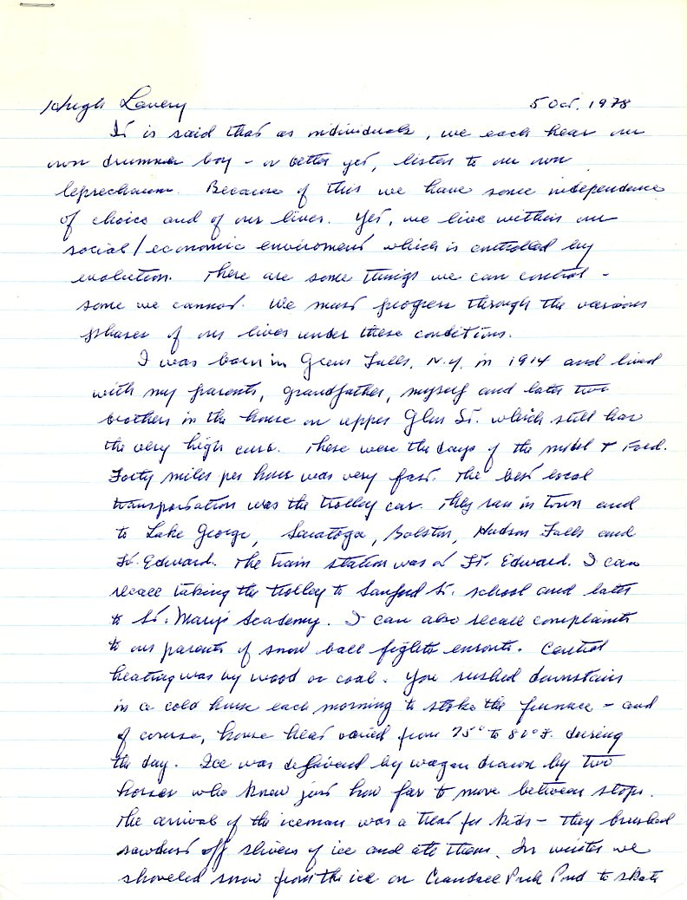
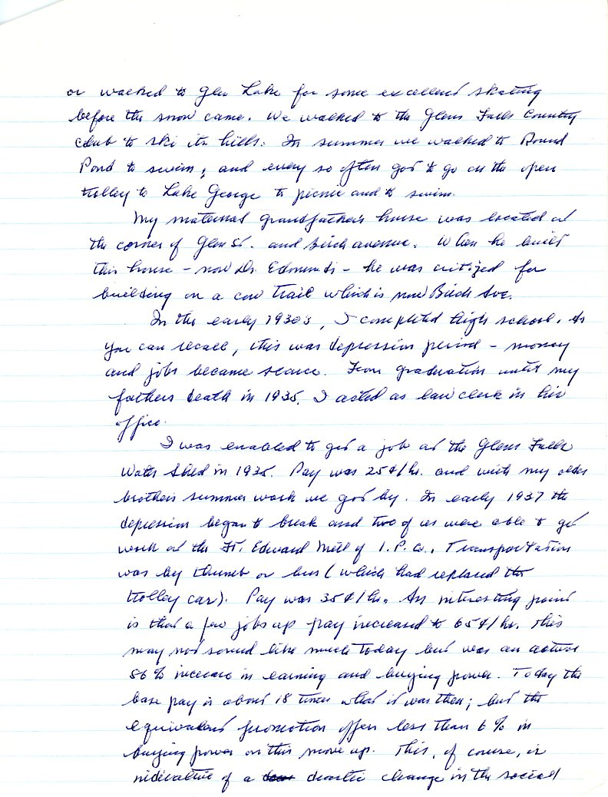
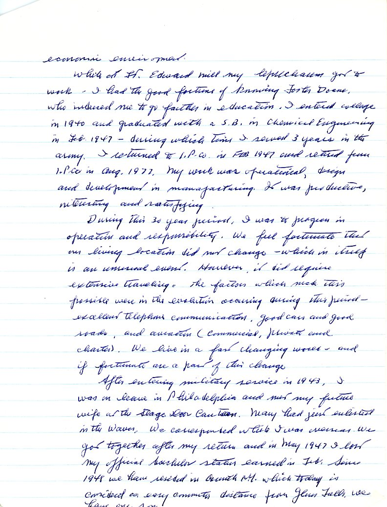

|  |
|:---:|
|*Hugh Heffron Lavery, circa 1944*|

|  |
|:---:|
|*Hugh Heffron Lavery, circa 1966*|

This was written as part of a "Remembering When" class for an adult education class in Glens Falls, NY written just about two months before he died of lung cancer.

|  |
|:---:|
|*Hugh Heffron Lavery obituary, Glens Falls "Post Star" (NY) December 28, 1978*|
